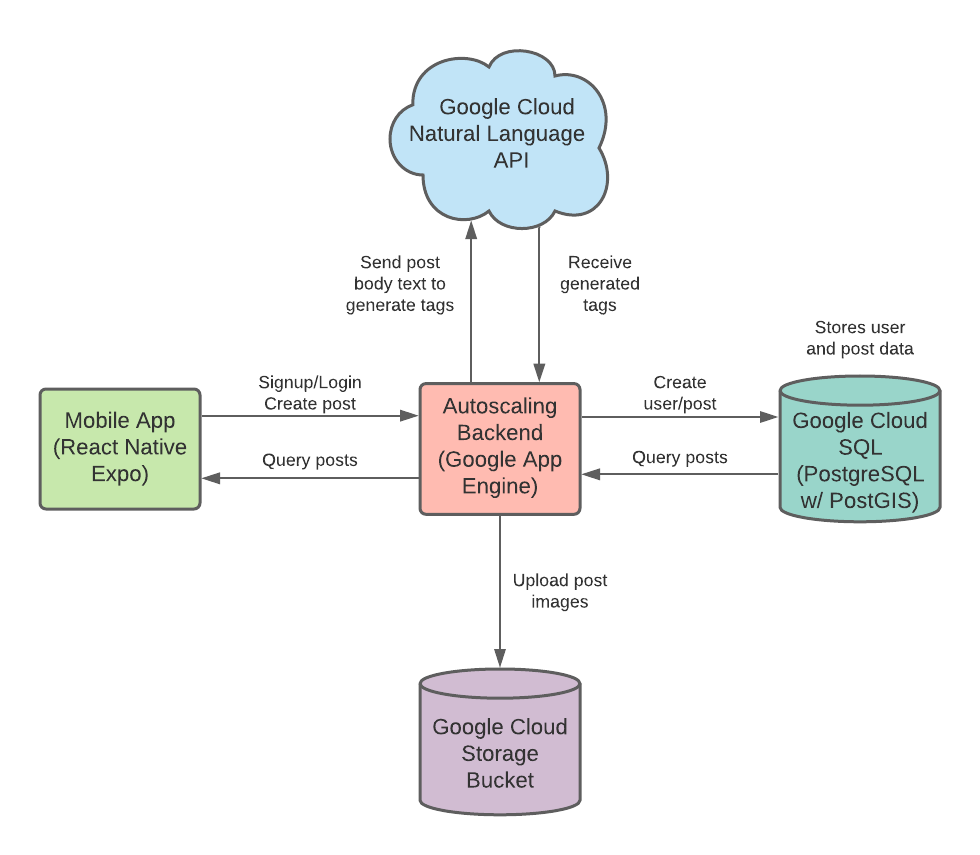

# World Bulletin Board
## The problem
The problem this projects helps solve is that people want a way to be able to engage with the community around them better. Sometimes people will hear about something really interesting that happened on an earlier day and is now done, or they just generally feel disconnected from their neighbors and community. Our app will address this problem by providing a virtual “World Bulletin Board” that will allow them to view posts that have been created by people physically nearby them. For example, suppose a person lost their dog. They can pin a "missing dog" notice at their location. Anyone that walks within a certain distance of this pin will see a post containing the "missing dog" notice. If someone has a garage sale, they can pin a "garage sale" event at their garage, and anyone that walks within some radius of the pin will see the garage sale. Users will have the ability to create an account and set preferences for things that they are interested in, and will see only posts that are interesting to them.

## Background
The project is a platform where users can post news and events to a global bulletin board. Although the bulletin board is global, a user only sees posts that are within a certain radius of the user's current location. In order to support efficient queries for posts based on a geographic radius, we need a database that can support these kinds of geographic queries. This is why we decided to use PostgreSQL with PostGIS hosted on Google Cloud SQL. The PostGIS extension allows us to easily do a query for posts within a certain radius, which is a core functionality that our app needs to support.

Not all news is interesting to a user. In order to help users filter out posts based on their interest, we use Google Cloud Natural Language API in order to generate category tags for posts. The way this works is that when a post is uploaded, the text body of the post is sent to the Google Cloud Natural Language API, and this service generates category tags, which are then stored along with the post in the database. When other users query for posts, they can set a list of tags that they are interested in, and queries will only return posts in a certain radius that contain at least one of the tags the user is interested in.

## But why is this problem important?
People want to be informed about news and events in their local vicinity. Being informed about local news and events is an important part of being an active member of a local community. However, it is not always easy to get access to such localized news. People have traditionally relied on physical means such as fliers and community bulletin boards to advertise news and events, but these can be inconvenient. Our app is intended to solve this issue by providing a platform where users can upload posts to a virtual bulletin board and associate their current geographic location with the posts. Users that walk within a certain geographic radius of the posts will be able to see the posts in the app. With our app, users are now able to view news and event postings that are local to their current location with the convenience of a mobile app.

## Why existing solutions don't cut it
There are some apps out there that are geared towards providing localized news. One such example is Nextdoor. Nextdoor has the concept of communities, and people can join a community and receive localized news in their community. However, as far as we know, Nextdoor is only focused on the community in which a user is currently living in. If users travel to a different city, then they cannot use Nextdoor to get local news about this different city. Our app is more dynamic; it allows users to get localized news based on their current location, not just the neighborhood they are living in. As a result, if a user travels to a different city, they will see the local news in that city.

Another source of localized news was Google Bulletin. Google Bulletin was an experimental app that integrated the concept of localized news in Google Search. However, that app no longer exists. Our app is not tied to any particular search engine.

## Architecture

***Mobile App***

The mobile app (shown in green in the architecture diagram) was implemented using React Native with Expo. The app consists of five main screens. The first screen that the user will see when they open the app is the login screen. From there, the user can either login to an existing account and move on to Root, or they could instead go to the sign up screen. This screen allows the user to create a new account and move to Root, or go back to the first login screen. Root consists of three tabs, each of which can be accessed by clicking on the button on the navigation bar on the bottom of the screen. The first tab is “Near Me”, which shows posts that the user would potentially be interested in. The second tab is “Upload New Pin”, which lets the user upload a new pin to the database. The third tab is “Interests”, which lets the user select which categories they are interested in seeing posts of.

***Autoscaling Backend***

The autoscaling backend (shown in pink in the architecture diagram) was implemented as a web server using Python on the Flask framework. This web server exposes five REST API routes: POST /signup, POST /login, POST /refresh_token, GET /posts, and POST /upload. The parameters for the POST routes are specified as form data, and the GET /posts route parameters are specified as url parameters.

The POST /signup endpoint is used to create a new user account. The user specifies a username, password, email address, and, optionally, first name and last name via request form data. The password is hashed before it is inserted into the database along with the rest of the user data. Once the user is successfully created in the Cloud SQL PostgreSQL database (shown in turquoise in the architecture diagram), an access token (used for accessing authenticated routes in our application) and refresh token (used to refresh the access token) are generated for the user. These tokens are implemented as JSON web tokens. The tokens, as well as the user object are returned to the user. The access token and user are returned in the JSON response payload, while the refresh token is stored in an HTTP-only cookie.

The POST /login endpoint is similar to the POST /signup endpoint, except that this endpoint is used to log an existing user in using a username and password supplied as request form data. When receiving a login request, the corresponding request handler first retrieves the user in the database with the supplied password and verifies that the password matches with the password hash. If the verification is not successful, then a 401 error is returned; otherwise, access and refresh tokens are generated for the user, and the tokens and user object are returned to the user.

The POST /refresh_token endpoint is used to refresh the user's access token using the provided refresh token. The user ID is extracted from the refresh token, and a new access token for that user is generated and returned to the user if the refresh token provided is valid.

The GET /posts endpoint is used to query for posts in the database within a given radius of a specified longitude-latitude coordinate and having the specified category tags. If no tags are specified, then all posts within the given radius of the given longitude-latitude coordinate are returned regardless of the tags of the posts; otherwise, only the posts with the specified tags are returned. The tags are specified in the URL parameters as a comma-separated list of category names.

The POST /upload endpoint is used to upload a new post. The user specifies a post title, body, latitude, longitude, and optional image. The image is specified in the form data as a Base64-encoded image with the format data:image/{IMG_TYPE}; base64, {BASE_64_ENCODED_IMAGE}, where {IMG_TYPE} is the type of image (e.g. png, jpeg, etc.) and {BASE_64_ENCODED_IMAGE} is the actual image in Base64-encoded form. Before the post is inserted into the database, the body text of the post is sent to the Google Cloud Natural Language API (shown in blue in the architecture diagram) in order to generate category tags for the post. The post title, body, longitude, latitude, and generated tags are then inserted into the database. If an image was specified, the image is first decoded from Base64 to obtain the bytes of the image, and the image bytes are uploaded to Google Cloud Storage (shown in purple in the architecture diagram) with the filename "{POST_ID}.{EXT}," where {POST_ID} is the ID of the post just inserted into the database, and {EXT} is the specified {IMG_TYPE}. The public URL of the post image is then saved to the database.

The backend was deployed on Google App Engine, and autoscaling was configured.

***Google Cloud SQL database***

The data for this application is stored in a PostgreSQL database on Google Cloud SQL with the PostGIS extension enabled. The database consists of a user table and a post table. The users table stores the user ID, username, hashed password, first name, last name, email address, and creation timestamp of the user, while the posts table stores the post ID, author ID, title, body, image URL, longitude, latitude, category tags, creation timestamp, and update timestamp of the post.

***Cloud services used***

Several GCP cloud services were used in the project. To host the backend server of the application, we used Google App Engine and configured it to autoscale using its automatic scaling feature. In order to automatically generate tags for a post, we utilized the Google Cloud Natural Language API in order to generate category tags for each post based on the post body text. These category tags allow users to filter posts based on their interests. For storing images associated with posts, we used a Google Cloud Storage bucket. To store user account information and the uploaded posts, we used a PostgreSQL instance from Google Cloud SQL with the PostGIS extension enabled to facilitate query posts by geographic range.

Google App Engine is used to host the backend server of our application. The backend server of our application contains authentication logic as endpoints to upload a post and query posts based on provided location, radius, and category interest tags. As a result, the backend server of our application needs to be able to scale in response to load in order to be able to fulfill all of these functions in a scalable manner Thus, Google App Engine servers as a scalable platform for our backend server.

The bottleneck of our application is clearly the backend server hosted on Google App Engine, as this server needs to be able to support several functionalities including authentication, uploading posts, and querying posts. In particular, many users could be uploading posts at the same time, and even more users could be querying for new posts around them at the same time. Thus, we needed a way to autoscale our backend. Google App Engine itself provides autoscaling functionality that we were able to make use of.

Our application deployed on Google App Engine is configured to autoscale to up to 10 instances based on the load that the application is receiving. The minimum number of instances running at any given time was configured to be 1, and the maximum number of concurrent requests that a given App Engine instance of our application can handle is 10. These parameters were configured in the app.yaml configuration file of our backend. By leveraging Google App Engine's automatic scaling capabilities, our application is able to scale appropriately based on request rate, with a higher request rate triggering more instances to be spawned, and a period of low request rate causing instances to be terminated.

## How the proposed solution solves the problem
The proposed solution offers a way for users to share and receive localized news on a global bulletin board in a scalable fashion. Users are able to see posts in their local vicinity and filter out posts based on their interests. This enables users to be more informed about what is happening in their local community regarding topics that they care about.

The solution is a real-time solution that leverages geographic queries to find localized news based on the user's current location. While apps like NextDoor focus on news from a particular neighborhood that a user is part of, our app provides local news wherever a user goes. This means that if a user travels to another city, they can see all of the local news in that city populated in the app. This makes our application a more dynamic means of receiving news in a user's immediate local vicinity.

## Testing and Evaluation
We carried out multiple load-tests to determine how well our application performs under load while autoscaling as and when required. We adopted a data generator based testing model where we iteratively generate data to test multiple workflows of the application.

We began by writing a function to generate some defined number of location coordinate points (pairs of longitudes and latitudes) within a predefined radius from a central coordinate point.  We followed a 2 step strategy to generate a large database of coordinate points to choose from for testing. First, we choose a central coordinate point  and use the above described function to generate 20 random coordinate points within a radius of 5000 kilometers. This gave us 20 distinct coordinate points which are far apart from each other. We assume that these are 20 users in geographically distinct locations across a country. In the second stage, we parse through each of these 20 coordinate points and generate 50 coordinate points within a 5 kilometer radius of each of these 20 coordinate points. This gives us 50 coordinate points for 50 potential posts per locality of each of the 20 users. In total this helped us generate 1000 distinct coordinate points.

Next, we created a list of 11 posts with example titles, bodies and images which return roughly independent categories of tags when passed through the Google Cloud Natural Language API. For creating a random post, our generator function would first randomly choose a post out of this list of posts and assign it a unique identifier (post number) which will be appended to the post number. It would then choose a random coordinate point from the list of 1000 coordinate points and assign it to the post. The generator would return these randomly generated post parameters whenever it is invoked to return random post parameters.

Whenever the generator is invoked to return random fetch parameters, it will choose a random coordinate point from the list of 20 geographically distinct coordinate points. It will also choose a random radius of upto 5 kilometers and a list of randomly sampled tags from the list of all possible tags. These 4 parameters (longitude, latitude, radius and tags) are then returned as parameters to fetch posts.

We used CPU multithreading to simulate parallel users, each thread posing as a different user to the application. We conducted 2 stress tests on our application. One to see if the application performs optimally if many users concurrently upload posts and the other to see if the application performs optimally if many users concurrently fetch posts based on their location. To make the test even more challenging we assumed that each user is logging in before making requests to upload or fetch posts.

For testing concurrent uploads, we created 100 threads, each invoking the generator function twice to get post parameters and sending post requests using these parameters. This is equivalent to emulating 100 users, each one first logging in and uploading 2 posts at once on the application. As expected, GAE scales up to limit (10 instances) to serve all the concurrent post requests and downscales when it has processed all the requests.

For testing concurrent fetch requests, we created 500 threads, each invoking the generator function to get random fetch parameters (longitude, latitude, radius, tags) and then sending the fetch requests using these parameters. This is equivalent to emulating 500 users, who log into the application and send random fetch requests concurrently.  Again, as expected GAE scales up to the limit (10 instances) to serve all the concurrent fetch requests and downscales when it has processed all the requests.

## Code explained
***frontEnd (folder)***

The frontEnd folder contains all of the code for our mobile app written in React Native using Expo. It consists of the following files (prefixed by subfolder name):

screens/LoginScreen.tsx: This file contains code for the first screen that the user will see when they open the application. The user can either login and go be directed to the “Near Me” tab or can instead click “Create New Account”.

* LoginScreen({navigation}: This is the main function for the tab. It will return a View which has two Texts, two TextInputs, and two TouchableOpacitys.
* handleSignup(): This will redirect the user to the user to the Signup screen.
* handleLogin(): This will attempt to asynchronously login the user. If successful, it will redirect the user to the “Near Me” page.

screens/SignupScreen.tsx:This file will allow the user to create a new account and move to “Near Me”, or to go back to the login screen.

* SignupScreen({navigation}: This is the main function for the tab. It will return five TextInputs, two Texts, and two TouchableOpacitys.
* handleSignup(): This will send a request to the backend to create a new user in the user table. If successful, it will move the user to the “Near Me” screen and automatically login them in as the newly created user.
* handleLogin(): This will redirect the user to the login screen.

screens/TabOneScreen.tsx:This is the “Near Me” tab in the Root navigation. This screen will get the device’s location, trigger a notification be sent to the user, and will request that the backend queries the database for specific posts and will display the results of the request.

* Notifications.setNotificationHandler(): This method tells the screen what to do when a scheduled notification is triggered.
* TabOneScreen(): This is the main method for this tab. It contains all variables, functions (except for setNotificationHandler()), and styles. It will return a View which contains a Text, Button, and Flatlist. Each element in the Flatlist contains a View with two Texts and an Image.
* getData(): This method will asynchronously attempt to get the user’s “Interests” from the device’s local persistent storage. Will leave the “Interests” as empty if it fails.
* useEffect(): This will get the device’s location, and register the device to listen for and handle notifications. Once the location is successfully determined, then it will send an HTTP request to the backend to query all posts that are within a radius of the user’s location and are tagged with one of the user’s interests.
* updateList():  This is called when the “refresh” button is pressed. It will call getData() to update the user’s interests and will then send a request to the backend to the same query as described above in useEffect().
* schedulePushNotification(): This will schedule a push notification to be sent at a certain time. For the demo, we had it sent 60 seconds after first opening the tab to show the TA. In practice, we would have it schedule a notification to send once a day, perhaps at 9 am or 10 am.
* registerForPushNotificationsAsync(): This will request the required permissions from the device to be able to schedule and send push notifications.

screens/TabTwoScreen.tsx: This screen allows the user to create a new pin and upload it to the database. The pin consists of a title, body, image, and the device’s coordinates

* TabTwoScreen(): This is the main method for this tab. It contains all variables, functions, and styles. It will return a View which contains a Text, and Image (if one has been selected), two TextInputs, two Buttons, and two empty Views to create space in the page.
* useEffect(): The first useEffect will get the user’s location.
* useEffect(): The second useEffect will get permission to use select images from the device’s photos.
* pickImage(): This will launch the ImagePicker and will return the result of the user’s actions within it.
* <Button onPress()>: When the button is pressed, an HTTP request containing the title, body, image, latitude, and longitude will be sent to the backend to create a new pin in the database. It will set the status to be the result of the request.

screens/preferenceScreen.tsx: This screen will allow the user to select their preferences from a MultiSelect and click a button to update them in the device’s persistent storage.

* PreferenceScreen({navigation}: This is the main function of the screen. It will return a ScrollView containing a MultiSelect, a Button, and a Text.
* storeData(): This is called when the Button is pressed. It will attempt to save the value of the selectedItems into the device’s persistent storage.

config/index.tsx: The config file contains global configuration variables used by the application. In our app, there is only one config variable appBaseUrl that stores the base URL of the backend server.

context/AuthProvider.tsx: This file defines AuthContext and AuthProvider:

* AuthContext: This is the React context that is used to access the current authentication context throughout the mobile app. The public interface of the context includes signup and login functions as well as token and user variables that store the access token and user object of the logged-in user, respectively.
* AuthProvider: Sets up a provider for AuthContext. The provider stores the token and user object as React state and implements the signup and login functions of the AuthContext. When these functions are called, they will signup/login the user and update the token and user object state returned by the signup/login call to the backend.

utils/auth.tsx: This file contains helper functions for performing various authentication functions on the backend, including creating a new user account, logging in, and refreshing the access token. These functions are as follows:

* signup({ username, password, firstName, lastName, emailAddress }): Makes a POST /signup request to the backend server of the application in order to create a new user account with the specified user data. Returns the response body of the HTTP request, which should contain the access token and the user info object corresponding to the newly created user.
* login({ username, password }): Makes a POST /login request to the backend server of the application in order to login in with the given username and password. Returns the response body of the HTTP request, which should contain the access token and the user info object corresponding to the logged-in user.
* refreshToken(): Makes a POST /refreshToken request to the backend in order to refresh the access token. Returns the response body of the HTTP request, which should contain the new access token and the user info object corresponding to the logged-in user.
* navigation/BottomTabNavigator.tsx: This file creates and returns the navigation bar that is on the bottom of each of the tabs in “Root”. Each tab has a button with an icon and title. When a button is pressed on the tab, the app will redirect the user to that button's corresponding screen. The BottomTabNavigator consists of TabOneScreen, TabTwoScreen, and PreferenceScreen.

navigation/index.tsx: This file creates a NavigationContainer, which contains a RootNavigator. The RootNavigator consists of the LoginScreen, SignupScreen, and BottomTabNavigator.

navigation/LinkingConfiguration: This file contains the configurations that other files use to link the different screens together.

***backend (folder)***

The backend folder contains all of our code that runs on Google App Engine. It consists of the following files:

main.py: This file defines the API route handlers for our backend web server. The handlers include:

* signup(): Responsible for user account creation. When a user sends a POST request to the /signup endpoint of our web server, the signup handler will create a new user in the database with the specified username, password, first name, last name, and email address. The password is hashed using bcrypt, and the password hash is stored in the database along with the user info. An access token and a refresh token is then generated for the user. The access token and user data is returned as a JSON response payload, and the refresh token is set in an HTTP-only cookie.
* login(): Responsible for handling a login request. When a user sends a POST request to the /login endpoint with a specified username and password, the login() endpoint retrieves the user with the specified username and verifies that the supplied password corresponds with the password hash stored in the database for that user. If the supplied password does not correspond to the password hash, then a 401 error is returned to the user. Otherwise, an access token and a refresh token is generated for the user, just as in the signup() handler, and both tokens and the user data is returned back to the user.
* refresh_token(): Responsible for generating a new access token for the user. When the user sends a POST request to the /refresh_token endpoint, if the user supplies a valid refresh_token, then a new access token will be generated for the user.
* posts(): Responsible for fetching posts given a latitude, longitude, radius (in km), a list of tags. When a user calls GET /posts with the aforementioned parameters, the posts() handler will invoke the get_posts() function of the db.py file in order to get all the posts within the specified radius of the specified latitude/longitude coordinate and with the specified category tags.
* upload(): Responsible for post creation. When a user sends a POST request to the /upload endpoint, upload() handler will create a new post in the database with the specified title, body, and latitude/longitude coordinates. If the user specifies a base64-encoded image via the 'img' parameter, the base64 image is decoded into its byte representation, and these bytes are uploaded to Google Cloud Storage with the ID of the newly created post determining the name of the file. After the image is uploaded to Google Cloud Storage, the public url of the image is saved in the database.

auth.py: This file defines helper functions for performing user authentication related tasks. The handlers include:

* get_access_token(user_id): Creates a JWT access token for the user with the specified user ID. The access token is configured to expire after 30 minutes.
* get_refresh_token(user_id): Creates a JWT refresh token for the user with the specified user ID. The refresh token is configured to expire after 30 days.
* get_user_id_from_auth(): Parses the JWT token from the Authorization header of an authenticated request, verifies that the token is valid, then extracts the user ID from the payload of the verified token.
* get_user_id_from_refresh_token(): Verifies the JWT refresh token specified in the refreshToken cookie, verifies that the token is valid, then extracts the user ID from the payload of the verified token.
* hash_password(password): Hashes a plaintext password using bcrypt and returns the password hash as a UTF-8 string
* verify_password(password, hashed_password): Given a password and a password hash, verifies that the password matches with the hash. Returns true if matches, false otherwise.

Cloud_Natural_Language_categorize.py: This file contains a single function:

* tag_text(text_content): Given a piece of text (i.e. the body of a post), this function calls the Google Cloud Natural Language API in order to generate content categories for the text. A list containing the tags is returned.

db.py: This file contains helper functions for accessing the PostgreSQL database that we are using to store the user and post data. It contains the following functions:

* get_db_connection(): Gets a connection to the PostgreSQL database using the database name, user, password, host, and port specified in the DB_NAME, DB_USER, DB_PASSWORD, DB_HOST, and DB_PORT environment variables, respectively.
* create_user(username, hashed_password, email_address, first_name, last_name): Creates a new user in the database with the specified username, password hash, email address, first name (optional), and last name (also optional). Returns a Python dictionary representing the newly created user in the database.
get_user_by_username(username): Gets the user in the database with the specified username and returns a Python dictionary representing the retrieved user.
* get_user_by_id(user_id): Gets the user in the database with the specified user ID and returns a Python dictionary representing the retrieved user.
* create_post(user_id, title, body, latitude, longitude): Creates a new post in the database with the specified user ID, title, body, latitude, and longitude. Returns a Python dictionary representing the newly-created post.
* set_img_url(post_id, img_url): Sets the img URL of the post with the specified post ID.
* get_posts(curr_latitude, curr_longitude, radius_km, curr_tags): Performs a PostGIS query in order to find all points that are within radius_km km of (curr_latitude, curr_longitude) point and containing at least one tag specified in curr_tags. If curr_tags is an empty list, then all posts within the radius are returned, regardless of tag.

storage.py: This method contains helper methods for interacting with Google Cloud Storage.

* create_bucket(bucket_name): Creates a Google Cloud Storage bucket with the specified name.
* upload_image(filename, content, content_type): Uploads the image bytes supplied in the content parameter to the Google Cloud Storage bucket specified by the BUCKET_NAME environment variable using the specified filename and content type. After uploading the file, the public URL of the file is returned.

app.yaml: This file contains the Google App Engine configuration for our backend server. Autoscaling is set up via the automatic_scaling section of the yaml file, where we specify the minimum number of instances running to be 1, the maximum number of instances running to be 10, and the maximum number of concurrent requests an App Engine instance can process to be 10.

The env_variables section of the app.yaml file specifies the following environment variables which will be made available to the backend code:

* DB_NAME: The name of the database
* DB_USER: The name of the database user
* DB_PASSWORD: Password corresponding to the database user
* DB_HOST: The IP address of the database
* BUCKET_NAME: The name of the Google Cloud Storage bucket being used to store the post images
* ACCESS_TOKEN_SECRET: The secret used to sign the JWT access tokens
* REFRESH_TOKEN_SECRET: The secret used to sign the JWT refresh tokens

***generator (folder)***

Contains all the code required for load-testing the application

ApiClient.py: This file contains functions with queries for which we want to load-test our application

* login(username, password): Will query the application to login as a user with the defined username and password
* create_post(title, body, lat, lon, img): Will query the application to create a new post for the given post attributes: title, body, latitude/longitude (location coordinates of the post), image associated with the post
* get_post(lat, lon, radius_km, tags): Will query the application to fetch posts for the given attributes: latitude/longitude (location coordinates of the user), vicinity radius in kilometers (radius around the user for which the posts must be returned), tags (user selected categories for the posts)

generate_random_coordinates.py: This file contains the functions required to generate coordinates
for load-testing the application

* create_random_point(latitude, longitude, distance): Given a location (latitude, longitude) and the maximum distance from the location, generates a random location coordinate pair (latitude, longitude) with a distance less than the maximum distance from the given location
* generate_random_points(latitude, longitude, radius, number_of_points): For a given location (latitude, longitude) and radius (maximum distance of location points from the given location), calls the create_random_points function number_of_points number of times and stores the randomly generated coordinate points in a csv file
* generate_random_points_from_other_points(radius, number_of_points_per_point): Given a radius and number_of_points_per_point, parses the csv file generated by the generate_random_points function line by line, generating number_of_points_per_point number of coordinate pairs, within a distance defined by the radius from the coordinate pair in each line. The new list of coordinates is stored in a separate csv file

data_generator.py: This file contains the functions which generate random attributes for the queries sent to the application for load-testing. It also contains a list of 11 posts with predefined content:

* read_image(filepath): Reads the image at the given file path, checks if the image is already in cache, if not, encodes it into base64 format, decodes it into its byte representation, saves it in cache and passes these bytes as the image parameter for the post. If the image is already in cache, the bytes are read from the cache and are passed as the image parameter for the post  
* generate_posts(single_threaded): Generates random parameters to upload new posts. Reads CSV file generated by the function generate_random_points_from_other_points of generate_random_coordinates.py line by line and selects a random coordinate pair (latitude, longitude) from it. It also selects a random post among the predefined list of posts and assigns the randomly selected coordinate pair to the randomly selected post. The tag_text function is invoked from Cloud_Natural_Language_categorize.py to categorize and tag the body of the post. The tags are assigned to the post. If the single_threaded parameter is set true then the CSV file is updated after deleting the coordinate pair used by the post
* fetch_post(): Generates random parameters for fetching posts. Reads CSV file generated by the function generate_random_points of generate_random_coordinates.py line by line and selects a random coordinate pair (latitude, longitude) from it. This coordinate pair represents the location of a random user who wants to fetch posts around their area. A random radius value is selected and a few tag categories are randomly sampled. Finally, the randomly selected latitude, longitude, radius and tags are returned as parameters for fetching a post

create_posts.py: This file is used to load-test logging in as a user and uploading new posts to the application:

* upload_posts(): Logs into the application with a predefined username and password. Fetches 2 sets of random post parameters from data_generator.py and queries the application to create new posts using these parameters
* test_upload(): Generates 100 parallel threads, each posing as a user to the application. Assigns the function upload_posts to each thread, essentially emulating 2 upload requests per user and 100 users sending post upload requests at the same time 

get_posts.py: This file is used to load-test logging in as a user and fetching posts from the application:

* retrieve_post(): Logs into the application with a predefined username and password. Fetches a set of random fetch-post parameters (randomly selected latitude, longitude, radius and tags) from data_generator.py and queries the application to retrieve posts that satisfy the constraints defined by these parameters
* test_upload(): Generates 500 parallel threads, each posing as a user to the application. Assigns the function retrieve_post to each thread, essentially emulating 500 users sending retrieve post requests at the same time

load_data.py: This file is used to populate the application with test data to load-test fetch queries:

* load_data(): Logs into the application with a predefined username and password. Fetches 1000 sets of random post parameters from data_generator.py and queries the application to create new posts using these parameters

***database (folder)***

The database folder contains one file (db.sql) that contains the SQL CREATE TABLE statements used to create the tables of our database.

db.sql: Contains SQL CREATE TABLE statements to create the users and posts table of the database. The users table stores the user ID, username, hashed password, first name, last name, email address, and creation timestamp of the user. The primary key of the users table is the user id. The posts table stores the post ID, author ID (i.e. the id of the user that authored the post), title, body, image URL, longitude, latitude, category tags, creation, and update date of the user. The primary key of the posts table is the post ID of the post. The author ID references the user ID specified in the users table.

## Steps to deploy the application
The frontend uses Expo 4.3.2 to build the application for iOS, Android, or as a web app. The application uses React Native, as well as the following packages: react-native-multiple-select, @react-native-async-storage, expo-notifications, expo-constants, @expo/vector-icons, expo-location, and expo-image-picker. To run the application, this can be done by calling “expo start” from within the directory the project is saved to. This will then start a server on your local machine. A screen will be opened on your web browser. You can click to run the application as a web app. If you wish to run the app from your phone, you must first download the “Expo Go” app to your phone. Then, you just need to scan the QR code that your server has generated and it should automatically launch the app on your phone in the Expo Go app.

The backend uses Python 3.9 as the runtime. The backend server can be run locally by first installing the necessary dependencies specified in the provided requirements.txt file, setting the environment variables specified in the app.yaml files to their appropriate values in your current terminal session, then running python main.py, where python is your Python 3.9 installation. This will start the backend server on your local machine on port 3000.

To install the backend code to Google App Engine, simply install and properly configure the Google Cloud command line SDK, then run gcloud app deploy in the backend folder in order to deploy the backend code to the Google App Engine with the parameters and environment variables specified in app.yaml.